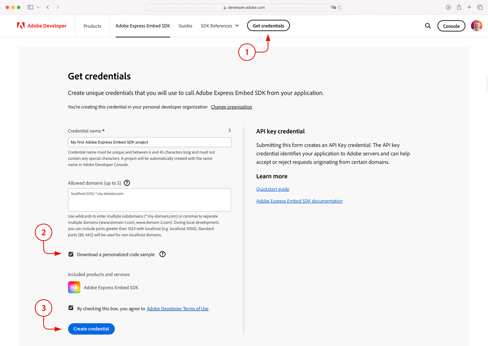

# Samples from the Adobe Express Embed SDK engineering team

This folder contains samples written by the Adobe Express Embed SDK engineering team, and originally distributed in the [`AdobeDocs/cc-everywhere`](https://github.com/AdobeDocs/cc-everywhere) repository.

## List of Samples

- [`v4-sample`](./v4-sample/sample.md): Sample project for the API v4.
- [`v3-sample`](./v3-sample/sample.md): Sample project for the API v3.
- [`v2-sample`](./v2-sample/README.md): Sample project for the API v2.
- [`get-credentials-sample`](./get-credentials-sample): Sample project as scaffolded by the [**Get credentials**](https://developer.adobe.com/express/embed-sdk/docs/get-credential/) workflow.

